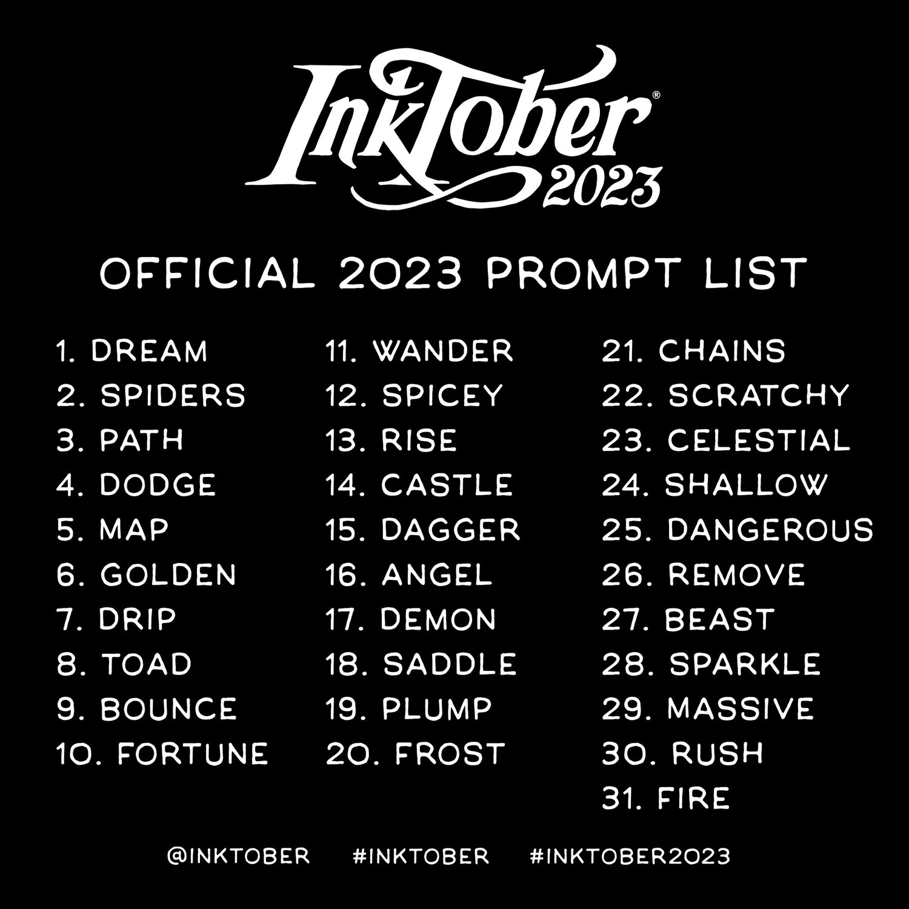

# Inktober

Creating varied art for Inktober.

## Examples

https://github.com/vess-dev/Inktober/assets/33204181/994192c8-7149-45a4-8082-b36cdc0997dc

https://github.com/vess-dev/Inktober/assets/33204181/81b90433-63e1-48f9-b235-815934efdda6

## Completion

- 2023 : 31/31 days complete in Processing 4. [DONE]
- 2025 : 1/31 days complete in q5.

## Requirements

- 2023: Processing 4 installed and Java mode.

## Directory

In the root level directory of this project:

- template.pde : A simple template to reuse for each 2023 day.
- template.js : A simple template to resuse for each 2025 day.

The 2023 folder contains the following structure:

- Prompts.png : The year's daily prompt list for each day.
- Day\[number\]\[prompt\] : A folder containing code for that day.

In each of the day folders you will find these files:

- Day\[number\]\[prompt\].pde : The Processing code for that day.
- Day\[number\]\[prompt\].mp4 : A short rendered mp4 of the code.

The 2025 folder contains the follow structure:

- Prompts.png : The year's daily prompt list for each day.
- Day \[number\] \[prompt\].js : The Javascript code for that day.

In the Output folder you will find thse files:

- Day \[number\] \[prompt\].mp4 : A short rendered mp4 of the code.

## Credit

Day 2, Path: https://unsplash.com/photos/green-palm-trees-near-brown-pathway-FbTMcaMhb1Y

Day 26, Remove: https://unsplash.com/photos/woman-in-black-dress-sitting-on-concrete-bench-during-daytime-GMeUXX-L7uE

Day 27, Beast: https://clipart-library.com/clip-art/garden-gnome-silhouette-14.htm

## License

https://creativecommons.org/licenses/by/4.0/
