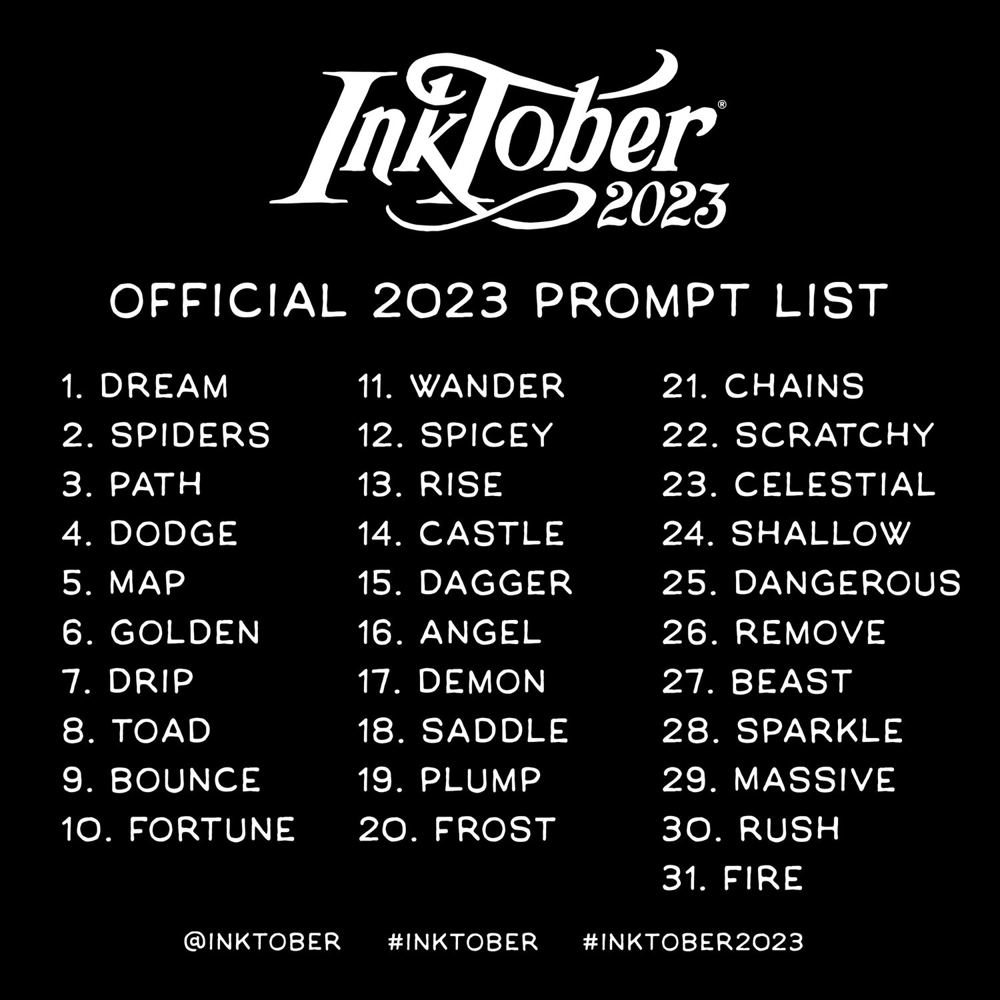

# Inktober

Inktober 2023 Prompts

## Completion

- 2023 : 1/31 days complete in Processing 4.

## Requirements

- Processing 4 installed.
- Java mode enabled.

## Directory

In the root level directory of this project:

- template.pde : A simple template to reuse for each day.

Each year folder contains the following structure:

- Prompts.png : That year's daily prompt list for each day.
- Day\[number\]\[prompt\] : A folder containing code for that day.

In each of the day folders you will find these files:

- Day\[number\]\[prompt\].pde : The Processing code for that day.
- Day\[number\]\[prompt\].mp4 : A rendered short mp4 of the code.
sketch.properties : A basic config file that Processing keeps.

## License

https://creativecommons.org/licenses/by/4.0/